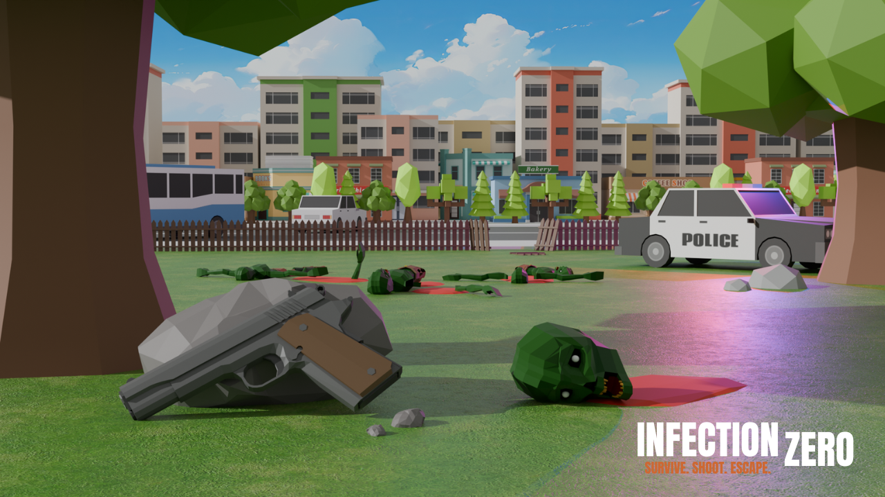
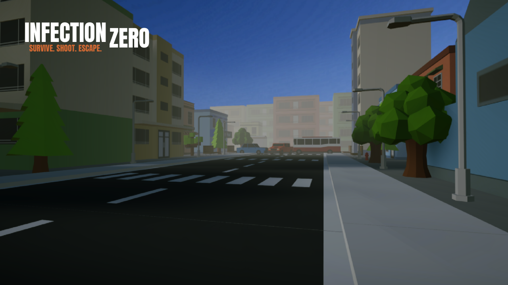
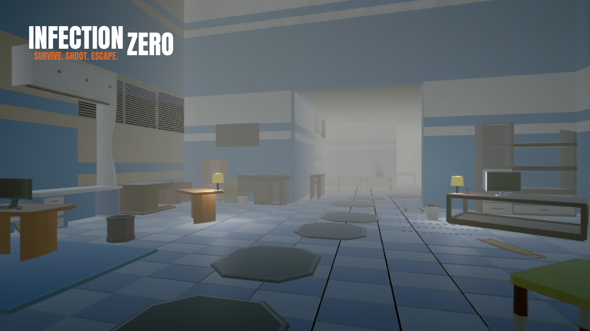
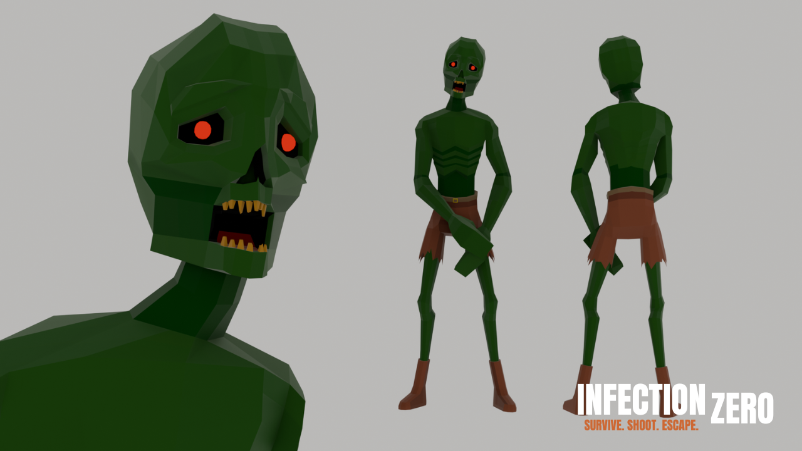

# 🧟 Infection Zero

**Survive the outbreak. Erase the infection.**

Infection Zero is a fast-paced **FPS zombie survival game** built with Unity for Android.  
Fight against waves of infected, complete missions, and upgrade your weapons to stay alive.

---

## 🎮 Gameplay

- First-person zombie shooting combat  
- Multiple mission types:
  - 🕒 Survive (Countdown)
  - 💀 Kill Zombies  
  - 📦 (More coming soon)
- Weapon system with upgrades  
- Stamina, health, and progression system  
- Mobile-friendly controls  

---

## 🔫 Weapons

- Pistol (Glock)
- Shotgun  
- Machine Gun  

Each weapon can be upgraded to deal more damage.

---

## 🖼️ Screenshots

### Gameplay

### Menu UI

---

## ⚙️ Built With

- Unity (C#)
- Blender (for models & renders)

---

## 📱 Download

👉 Play the game on itch.io:  
https://your-itch-link-here

---

## 🚧 Development Status

This project is currently in development.  
More features, enemies, maps, and improvements are coming soon.

---

## 👨‍💻 Developer

Solo developer from Bangladesh 🇧🇩  
Follow the journey and progress on social media.

---

## 💬 Feedback

Feel free to open an issue or share feedback.  
Your suggestions help improve the game!

---

## ⭐ Support

If you like the project, consider giving it a ⭐ on GitHub!
